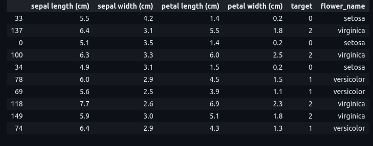

<h1>Working with Iris Dataset using Machine Learning in Python at ISB</h1>
 
<h2>Features</h2>
<ul>
  <li>Iris dataset from sklearn.datasets or CSV file</li>
  <li>SVM (Support Vector Machine)</li>
  <li>KNN (K Nearest Neighbors)</li>
  <li>Naive Bayes</li>
  <li>Decision Trees</li>
  <li>Random Forest Classifier</li>
  <li>Dimensionality Reduction: LDA</li>
  <li>GridSearchCV</li>
  <li>XGBoost Classifier</li>
  <li>DBSCAN Clustering</li>
  <li>K-Means</li>
  <li>silhouette_score, calinski_harabasz_score & adjusted_rand_score</li>
  <li>Principal component analysis: PCA</li>
</ul>
  
<h2>Acknowledgments</h2>

<b> Python3: http://bit.ly/python3-certifications <b>
 
<b> Machine Learning: https://bit.ly/machine-learning-certification <b>

<h2>Photo</h2>

 

<h2>Contact</h2>

<b> Email: mariusc0023@gmail.com </b>
